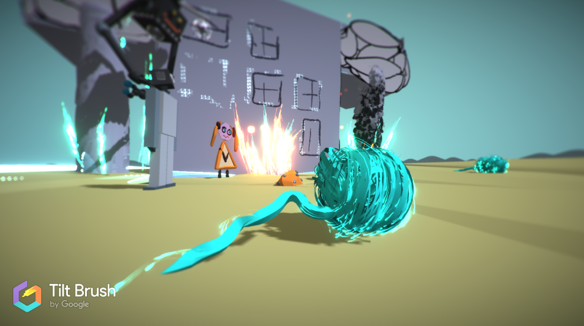

# UC001-Test101

Second practice in the Udemy course __Complete C# Unity Developer 2D - Learn to Code Making Games__
Developed on MacOS High Sierra with Unity Version 2018.2.6.f1.

## Text-Advanture Game

+ What is the game theme? 
    - SiFi Scenario with robots.

+ Who is the player? 
    - The player is Eduard the service robot.

+ What is the goal? 
    - Stay alive (does not die of thirst) until rescue is approaching.

#### Story: 
An accident destroyed all the water you had with you. ALso soem of the assistance robots are damaged. Now the robots think to be fighting robots. The place suffers from a long dry period and there are no wtater resources avaliable. Eduard a service robot has to ensure that Magdalena, his godhuman, does not die of thirst until rescue is approaching. In the area a special wool, which extracts water or argon from the air, is produced. Eduard now has the goal to find the wool before the fighting robots, who also aim to collect the wool to produce laser weapons on the basis of acron.
 

